<div align="center">
МІНІСТЕРСТВО ОСВІТИ І НАУКИ УКРАЇНИ<br>
Національний університет «Львівська політехніка»<br>
Інститут комп’ютерних наук та інформаційних технологій<br>
Кафедра «Системи автоматизованого проектування»
</div>

<div align="center">
БАКАЛАВРСЬКА КВАЛІФІКАЦІЙНА РОБОТА
</div>

<div align="center">
на тему
</div>

<div align="center">
<strong>«Проєктування та реалізація інтелектуальної вебплатформи адаптивного навчання»</strong>
</div>

**Спеціальність:** 122 «Комп’ютерні науки»  
**Освітній рівень:** перший (бакалаврський) рівень вищої освіти  
**Досліджуваний програмний продукт:** AI-Learn / TestGen AI  
**Виконав(ла):** **************\_\_\_\_**************  
**Група:** **************\_\_\_\_**************  
**Керівник:** **************\_\_\_\_**************

<div align="center">
Львів 2026
</div>

\newpage

# ЗАВДАННЯ НА БАКАЛАВРСЬКУ КВАЛІФІКАЦІЙНУ РОБОТУ

**Студент:** **************\_\_\_\_**************  
**Спеціальність:** 122 «Комп’ютерні науки»  
**Кафедра:** «Системи автоматизованого проектування»  
**Тема роботи:** Проєктування та реалізація інтелектуальної вебплатформи адаптивного навчання  
**Керівник:** **************\_\_\_\_**************

**Вихідні дані до роботи:** репозиторій AI-Learn, локально запущені фронтенд і бекенд, результати автоматизованих тестів, згенеровані скріншоти інтерфейсу, діаграми архітектури, дані аналізу API та модулів застосунку.

**Зміст пояснювальної записки:** вступ; аналіз теоретичних засад адаптивного навчання; аналіз предметної області та вимог; архітектура системи; реалізація ключових модулів; алгоритми й обчислення; практичний аналіз інтерфейсу; тестування, безпека та якість; напрями розвитку; висновки; список використаних джерел; додатки.

**Перелік графічного матеріалу:** архітектурна схема системи; діаграма базового користувацького сценарію; діаграма послідовності автентифікації; ER-модель; діаграма адаптивної навчальної сесії; скріншоти головної сторінки, панелі навчання, створення тесту, бібліотеки тестів, сторінок результатів, аналітики, флешкарт і досягнень.

**Термін подання завершеної роботи:** **************\_\_\_\_**************  
**Дата видачі завдання:** **************\_\_\_\_**************

\newpage

# АНОТАЦІЯ

У бакалаврській кваліфікаційній роботі подано технічний і функціональний аналіз вебплатформи адаптивного навчання AI-Learn / TestGen AI. Об’єктом дослідження є програмна система, що поєднує генерацію тестів засобами штучного інтелекту, персоналізовані навчальні сесії, повторення за інтервалами, флешкарти, аналітику прогресу та засоби контролю проходження тестів. Метою роботи є встановити, яким чином архітектурні рішення, алгоритми обчислення mastery, рекомендаційна логіка та організація користувацьких сценаріїв забезпечують цілісну освітню функціональність системи.

У роботі використано методи структурного аналізу кодової бази, порівняльного аналізу архітектурних рішень, практичної верифікації через навігацію працюючим застосунком, а також аналізу результатів автоматизованих тестів. Дослідження охоплює фронтенд на React, серверну частину на Express, REST API, модулі автентифікації, модель збереження даних на основі SQLite через sql.js, сервіси адаптивного навчання, флешкарт і рекомендацій.

У результаті встановлено, що платформа реалізує повний навчальний цикл: від створення тесту або практики за темою до аналізу помилок, формування повторної активності та накопичення історії прогресу. Практична цінність роботи полягає в тому, що отриманий матеріал може бути використаний як основа для подальшого розвитку продукту, академічного оцінювання архітектури програмної системи та вдосконалення освітніх EdTech-рішень.

**Ключові слова:** адаптивне навчання, бакалаврська кваліфікаційна робота, вебплатформа, штучний інтелект, React, Express, SQLite, флешкарти, персоналізоване тестування, рекомендаційна система.

\newpage

# ABSTRACT

The bachelor's qualification paper presents a technical and functional analysis of the adaptive learning web platform AI-Learn / TestGen AI. The object of research is a software system that combines AI-assisted test generation, personalized learning sessions, spaced repetition, flashcards, progress analytics, and tools for supervising test attempts. The goal of the paper is to determine how the architecture, mastery calculation logic, recommendation mechanisms, and user-facing workflows form a coherent educational product.

The study applies codebase structure analysis, comparison of architectural decisions, practical verification through a running local instance of the application, and interpretation of automated test results. The paper covers the React-based frontend, the Express backend, the REST API, authentication modules, the SQLite persistence layer implemented through sql.js, and the services responsible for adaptive learning, flashcards, and recommendations.

The results show that the platform implements a full learning cycle: from test generation or topic-based practice to result analysis, follow-up repetition, and long-term progress tracking. The practical value of the work lies in its suitability as a technical basis for further product development, academic evaluation of software architecture, and refinement of modern EdTech solutions.

**Keywords:** adaptive learning, bachelor's qualification paper, web platform, artificial intelligence, React, Express, SQLite, flashcards, personalized testing, recommendation system.

\newpage

# ЗМІСТ

_Зміст формується автоматично у Word під час оновлення полів документа._

\newpage

# ПЕРЕЛІК УМОВНИХ ПОЗНАЧЕНЬ, СИМВОЛІВ, ОДИНИЦЬ, СКОРОЧЕНЬ І ТЕРМІНІВ

| Скорочення | Значення                                   |
| ---------- | ------------------------------------------ |
| ШІ         | Штучний інтелект                           |
| API        | Інтерфейс програмування застосунків        |
| SPA        | Односторінковий вебзастосунок              |
| JWT        | JSON Web Token                             |
| REST       | Архітектурний стиль взаємодії через HTTP   |
| БД         | База даних                                 |
| UI         | Користувацький інтерфейс                   |
| UX         | Користувацький досвід                      |
| LLM        | Велика мовна модель                        |
| SRS        | Система повторення за інтервалами          |
| SM-2       | Алгоритм планування повторення SuperMemo 2 |
| CRUD       | Створення, читання, оновлення, видалення   |
| QA         | Забезпечення якості                        |

У тексті кваліфікаційної роботи використовується подвійна назва продукту. Формулювання **AI-Learn** застосовується, коли йдеться про структуру репозиторію, кодову базу та внутрішню архітектуру. Формулювання **TestGen AI** використовується стосовно того брендингу, який відображається у працюючому інтерфейсі. В обох випадках мається на увазі один і той самий програмний продукт.

\newpage

# ВСТУП

Останні роки характеризуються стрімкою трансформацією цифрової освіти. Якщо ранні вебсистеми для навчання були переважно сховищами матеріалів або механізмами перевірки знань за заздалегідь підготовленими питаннями, то сучасні навчальні платформи мають забезпечувати значно складнішу поведінку: аналізувати прогрес користувача, адаптувати рівень складності, рекомендувати повторення, формувати персоналізовані траєкторії навчання та підтримувати довготривале засвоєння матеріалу. Саме на перетині цих вимог і виникає інтерес до систем, що поєднують можливості штучного інтелекту з традиційними вебтехнологіями.

Досліджуваний у цій роботі проєкт належить саме до такого типу систем. Він не є простою платформою для створення тестів або набором сторінок із флешкартками. У ньому реалізовано взаємопов’язаний цикл: користувач може ввести тему або завантажити власні матеріали, отримати автоматично згенерований тест, пройти його, переглянути результат, сформувати флешкарти з помилок, повернутися до слабких концептів, побачити оновлений прогрес і отримати наступну рекомендацію. Таким чином, тестування в системі є не фінальною дією, а лише частиною безперервного навчального процесу.

Актуальність теми визначається кількома причинами. По-перше, адаптивне навчання є одним із ключових напрямів розвитку сучасних EdTech-рішень. По-друге, зростання доступності LLM дозволяє перейти від жорстко запрограмованого контенту до динамічно згенерованих навчальних активностей. По-третє, подібні системи вимагають не лише вдалого інтерфейсу, а й ретельно спроєктованої архітектури: без контролю над форматом даних, логікою доступу, якістю збереження та механізмами перевірки навіть хороший інтерфейс буде ненадійним. По-четверте, досліджуваний репозиторій вже містить достатньо реалізованих модулів, щоб виступати не як абстрактна ідея, а як реальний кейс для академічного аналізу.

Об’єктом дослідження є вебплатформа адаптивного навчання, побудована на сучасному JavaScript-стеку. Предметом дослідження є архітектура, функціональні модулі, алгоритми прийняття рішень, механізми обробки даних та користувацькі сценарії, що забезпечують персоналізоване навчання в цій системі.

Метою бакалаврської кваліфікаційної роботи є дослідити, як саме можна спроєктувати й реалізувати інтелектуальну навчальну вебплатформу, яка поєднує генерацію тестів, адаптивні практичні сесії, повторення за інтервалами, аналітику прогресу та елементи гейміфікації в одному цілісному програмному продукті.

Для досягнення поставленої мети у роботі вирішуються такі завдання:

1. Проаналізувати теоретичні засади адаптивного навчання, mastery learning та spaced repetition.
2. Визначити предметну область, ролі користувачів і типові сценарії використання платформи.
3. Систематизувати функціональні та нефункціональні вимоги, що відображені у репозиторії.
4. Дослідити архітектуру фронтенду, бекенду та моделі зберігання даних.
5. Описати реалізацію ключових модулів: генерацію тестів, навчальну панель, флешкарти, рекомендації, досягнення та аналітику.
6. Розглянути алгоритми оцінювання прогресу, планування повторення та формування рекомендацій.
7. Перевірити реалізацію через аналіз працюючого інтерфейсу, скріншоти та виконання автоматизованих тестів.
8. Сформулювати переваги, обмеження та напрями подальшого вдосконалення системи.

У роботі застосовано комплекс методів дослідження. Теоретичний аналіз використовується для опису педагогічних та інженерних підходів. Структурний аналіз допомагає розкласти систему на рівні: UI, API, сервіси, репозиторії, база даних. Порівняльний підхід застосовано до оцінки архітектурних рішень. Практична верифікація здійснена через запуск застосунку, навігацію реальними сторінками, перевірку станів користувача в браузері та виконання релевантних тестових наборів на бекенді.

Важливою перевагою цієї кваліфікаційної роботи є її доказова база. У документі використано новий набір інформативних скріншотів, отриманих із працюючої локальної версії застосунку. Для входу було використано тестовий обліковий запис, що дав можливість перевірити не лише головну сторінку, а й глибокі функціональні екрани: панель навчання, створення тесту, історію спроб, рев’ю-тести, флешкарти, деталі концепту, сторінку результатів і аналітику власника тесту. Крім цього, були виконані цільові бекенд-тести, що підтвердили коректність важливих API-сценаріїв.

Практичне значення роботи полягає в тому, що вона демонструє реальний шлях від освітньої концепції до програмної реалізації. Описаний матеріал може бути корисним одночасно для викладача, який оцінює бакалаврську кваліфікаційну роботу; для розробника, який вивчає побудову EdTech-продукту; і для команди, яка планує розвивати систему надалі. Тому поданий звіт є не лише описовим, а й аналітичним та прикладним.

\newpage

# 1. Теоретичні засади адаптивного цифрового навчання

## 1.1. Адаптивне навчання як педагогічна та технологічна концепція

Адаптивне навчання можна визначити як організацію навчального процесу, за якої зміст, послідовність завдань, складність і частота повторення змінюються відповідно до поточного стану користувача. У традиційному навчанні подібну роль виконує викладач: сильнішим студентам дають складніші задачі, тим, хто відстає, пояснюють базові речі повторно, а після типових помилок підсилюють увагу до конкретних тем. У цифровій системі цю поведінку потрібно виразити через дані, алгоритми та інтерфейс.

Технологічно адаптивне навчання спирається на три фундаментальні компоненти. Перший компонент — модель користувача: система має хоча б у спрощеній формі розуміти, що саме вже засвоєно, а що ні. Другий компонент — збір доказів: результати тестів, історія спроб, відсоток правильних відповідей, час останнього повторення, серії правильних чи неправильних відповідей. Третій компонент — механізм реагування: на основі зібраних даних система має змінити подальшу навчальну активність.

У досліджуваному проєкті ці три компоненти реалізовані цілком виразно. Модель користувача представлена сутностями `user_concepts`, `practice_sessions`, `concept_practice_history`, `user_achievements` та набором агрегованих показників на навчальній панелі. Доказами виступають відповіді на запитання, оцінки за тестами, історія спроб, прогрес у концептах та дати повторення. Реакцією системи є зміна складності наступних завдань, потрапляння концепту до списку слабких або прострочених, формування персональних рекомендацій та відображення цього у фронтенді.

З педагогічного погляду адаптивний підхід дає кілька переваг. Він зменшує перевантаження слабших користувачів, бо пропонує доступніший рівень складності. Він зменшує нудьгу сильніших користувачів, бо дозволяє переходити до більш складних питань. Він економить час, адже замість повторювати все підряд людина працює там, де є реальний дефіцит знань. Нарешті, він покращує саморефлексію: користувач бачить не лише загальний бал, а конкретні концепти, які потребують уваги.

Однак адаптивність не є автоматично позитивною. Якщо модель користувача погано спроєктована, система може неправильно інтерпретувати результати та формувати слабкі рекомендації. Якщо логіка рекомендацій непрозора, користувач починає сприймати її як випадкову. Якщо ШІ генерує неточні питання, система може закріплювати помилки. Саме тому адаптивне навчання в реальному застосунку неможливо відривати від питань архітектури, валідації та якості даних.

## 1.2. Генеративний ШІ в навчальних системах

Використання генеративного штучного інтелекту радикально змінює природу навчального вебзастосунку. Раніше для побудови тестової платформи потрібно було або зберігати великий банк заздалегідь підготовлених питань, або давати адміністратору інтерфейс ручного створення контенту. Сьогодні LLM дозволяє отримувати питання на вимогу — з довільної теми, нотаток або завантаженого документа. Це робить платформу значно гнучкішою, особливо в умовах самоосвіти чи швидкої підготовки до конкретної теми.

Проте інтеграція ШІ в освітній продукт вимагає дисципліни. Модель не можна просто попросити “створи тест” і без перевірки показати результат користувачу. Необхідно контролювати формат відповіді, кількість питань, наявність пояснень, рівень складності, прив’язку до концептів і мову, якою задано джерело. У досліджуваному проєкті генератор тестів запитує структурований JSON, а після отримання результату виконує постобробку: обрізає або доповнює набір до потрібної кількості питань, додає пояснення й посилання на фрагменти джерела, зберігає параметри генерації та модель, яка використовувалася.

Таке рішення є важливим інженерним компромісом. З одного боку, зберігається гнучкість генеративної моделі. З іншого — вихід LLM перетворюється на формат, придатний для автоматичної обробки в API, інтерфейсі та базі даних. Це один із ключових висновків роботи: ШІ не повинен існувати окремо від системної архітектури. Він має бути включеним у контрольований пайплайн.

З педагогічного погляду ШІ дає системі кілька сильних переваг. По-перше, він дозволяє працювати з матеріалом користувача: конспектами, нотатками, файлом. По-друге, він дозволяє варіювати формулювання завдань, тобто створювати декілька версій питань. По-третє, він полегшує перехід від загальної теми до конкретного завдання без участі викладача. По-четверте, система може зберігати однаковий формат роботи незалежно від предметної області: біологія, програмування, історія або інша дисципліна.

Водночас головний ризик полягає в семантичній якості. Навіть валідний JSON не гарантує, що питання педагогічно вдале, що правильна відповідь справді правильна, а пояснення достатньо точне. Через це подальший розвиток систем такого типу неминуче має включати модерацію, оцінювання якості контенту та механізми зворотного зв’язку від користувача.

## 1.3. Mastery learning і концептно-орієнтований прогрес

Mastery learning, або навчання до опанування, базується на припущенні, що користувач не повинен просто рухатись за календарем чи списком тем. Натомість система має фіксувати, наскільки добре він засвоїв конкретний концепт, і повертати його до слабких місць доти, доки рівень розуміння не стане достатнім. Це підхід, який добре поєднується з цифровою аналітикою, адже вебсистема може зберігати результати на рівні окремих тем і завдань.

У проєкті цей підхід виражений у числовому показнику mastery від 0 до 100 для кожного концепту користувача. Для кожного концепту зберігаються: загальна кількість спроб, кількість правильних відповідей, остання практика, наступна дата повторення, пропонований рівень складності, серії правильних і неправильних відповідей. Саме на основі цих даних навчальна панель може показувати слабкі теми, прогрес, прострочені повторення та рекомендації.

Математично оновлення mastery можна подати як

$$
M_{new} = \min(100, \max(0, M_{old} + w(d, r)))
$$

де $M_{old}$ — попереднє значення mastery, $d$ — складність питання, $r$ — правильність відповіді, а $w(d, r)$ — заздалегідь визначена вага для цього випадку.

У досліджуваній системі ваги є евристичними:

| Складність | Правильна відповідь | Неправильна відповідь |
| ---------- | ------------------: | --------------------: |
| Легка      |                  +5 |                    -8 |
| Середня    |                  +8 |                   -12 |
| Важка      |                 +12 |                    -5 |

Така модель не претендує на рівень академічних психометричних моделей, але вона добре підходить для прикладної системи: її легко зрозуміти, пояснити й модифікувати. Важливо, що система реагує не просто на підсумковий бал, а на характер відповідей, складність завдань і накопичену історію. Саме це перетворює її на adaptive learning system, а не лише на test runner.

## 1.4. Повторення за інтервалами та алгоритм SM-2

Одна з базових проблем навчання — швидке забування. Якщо матеріал не повторюється вчасно, навіть хороше первинне розуміння поступово зникає. Саме тому сучасні цифрові системи часто спираються на принцип spaced repetition — повторення не випадково і не за жорстким графіком, а в ті моменти, коли ризик забування максимальний.

У проєкті цей механізм реалізовано на двох рівнях. Перший рівень — повторення концептів. Для кожного концепту після практики обчислюється дата наступного повторення на основі mastery. Другий рівень — флешкарти, які працюють за логікою алгоритму SM-2 і дозволяють більш тонко керувати повторенням конкретних карток.

Для концептів правило таке:

| Mastery     | Наступне повторення |
| ----------- | ------------------- |
| менше 30    | через 1 день        |
| 30–49       | через 3 дні         |
| 50–69       | через 7 днів        |
| 70–79       | через 14 днів       |
| 80–89       | через 30 днів       |
| 90 і більше | через 60 днів       |

Для флешкарт використовується шкала якості від 0 до 5. Якщо оцінка менша за 3, інтервал скидається й картка знову з’являється майже відразу. Якщо оцінка 3 або більше, інтервал зростає залежно від поточного інтервалу та ease factor. Ease factor оновлюється формулою:

$$
EF' = EF + \left(0.1 - (5 - q)\left(0.08 + (5 - q) \cdot 0.02\right)\right)
$$

де $q$ — оцінка якості відповіді, а нижня межа для $EF$ дорівнює 1.3. Цей підхід є класичним для флешкарт-систем і добре інтегрується в освітні продукти, де короткі повторення мають великий вплив на довгострокове запам’ятовування.

## 1.5. Гейміфікація як механізм підтримки мотивації

Навчальний продукт має працювати не лише з когнітивним навантаженням, а й з мотивацією. Навіть добрий алгоритм рекомендацій не принесе користі, якщо користувач перестане відкривати застосунок. Саме тому в сучасних EdTech-системах гейміфікація має не декоративну, а прикладну роль: вона фіксує прогрес, створює короткі цілі та підсилює ефект регулярної практики.

У досліджуваному проєкті гейміфікація представлена через рівні, механіку серій занять, досягнення й індикацію загального прогресу. Це важливо тому, що система не зводить мотивацію до “зароби бейдж”. Досягнення прив’язані до реальних навчальних дій: кількості сесій, рівня опанування концептів, правильних результатів, роботи з флешкартами та безперервності практики.

Такий підхід є збалансованим: він не замінює навчання гейміфікацією, а робить реальний прогрес видимим. На практиці це видно на навчальній панелі та на окремій сторінці досягнень, де користувач бачить як уже отримані досягнення, так і прогрес до майбутніх цілей.

\newpage

# 2. Аналіз предметної області, ролей і вимог

## 2.1. Проблема, яку розв’язує система

Головна проблема, на яку відповідає платформа, — це розрив між навчальним матеріалом і практикою. У реальному житті студент або самостійний користувач часто має лише тему, конспект, уривок лекції чи файл. Однак між наявністю матеріалу та реальною перевіркою знань лежить значний бар’єр: потрібно придумати питання, структурувати їх, оцінити відповіді, повернутися до помилок і запланувати повторення. Більшість традиційних вебінструментів охоплює тільки один фрагмент цього циклу.

Досліджуваний проєкт намагається замкнути весь ланцюг. Користувач може почати з теми або нотаток, сформувати тест, пройти його, побачити результат, отримати слабкі місця, створити з них флешкарти, а потім повернутись до рекомендацій і повторення. Таким чином, система автоматизує не лише перевірку, а й подальшу навчальну роботу.

Друга проблема — відсутність персоналізації у звичайних тестових застосунках. Більшість із них працює за принципом “усім однакові питання”. У цій платформі, навпаки, персоналізація зашита в логіку самого продукту: складність, рекомендації, заплановані повторення, статистика по концептах і подальші сценарії залежать від накопичених даних конкретного користувача.

Третя проблема — слабка повторюваність навчання. Разове проходження тесту майже ніколи не гарантує довгострокового засвоєння. Тому система не закінчує сценарій на екрані результатів, а перетворює помилки на навчальні об’єкти: флешкарти, тести для повторення, записи в історії спроб і рекомендації на навчальній панелі.

## 2.2. Цільові ролі користувачів

| Роль                     | Основна мета                        | Типовий сценарій                                                                           |
| ------------------------ | ----------------------------------- | ------------------------------------------------------------------------------------------ |
| Самостійний користувач   | Вивчити або повторити довільну тему | Ввести тему, пройти практичну сесію, отримати результати, повернутися до слабких концептів |
| Студент                  | Виконати тест і закріпити помилки   | Приєднатись за кодом, пройти тест, переглянути результат, згенерувати флешкарти            |
| Власник тесту / викладач | Створити тест і відстежити спроби   | Згенерувати тест, поширити код, відкрити аналітику, переглянути спроби, закрити тест       |

Важливо, що одна й та сама система підтримує як індивідуальне навчання, так і розподілений сценарій “власник тесту – учасник”. Це видно і з набору маршрутів у фронтенді, і з наявності API для публічного доступу за кодом, таблиць спроб, лідерборду та сторінок аналітики власника тесту.

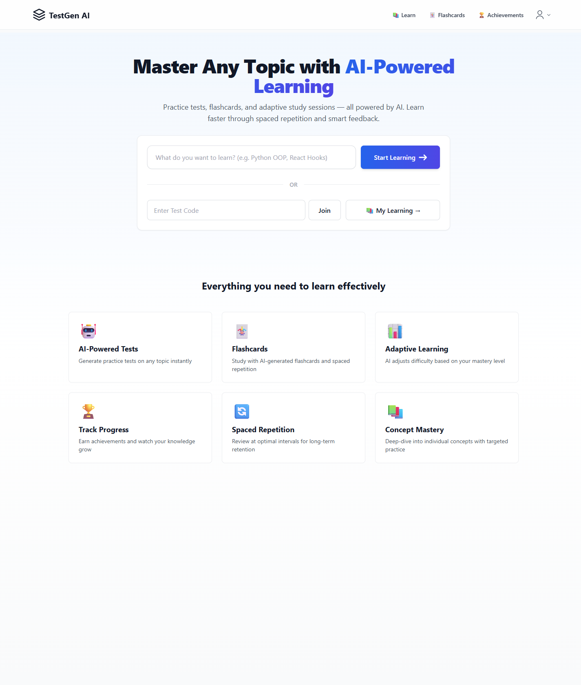

_Рисунок 1. Публічна головна сторінка застосунку: користувач може почати навчання з нової теми, ввести код уже створеного тесту та одразу побачити ключові можливості платформи._

## 2.3. Функціональні вимоги

На основі аналізу репозиторію, маршрутизації, API та інтерфейсу можна виділити такі ключові функціональні вимоги.

### 2.3.1. Автентифікація та профіль

Система повинна підтримувати реєстрацію, вхід, поновлення access token, отримання даних поточного користувача, зміну профілю й вихід. Автентифікація необхідна для навчальної панелі, флешкарт, досягнень, власних тестів та аналітики.

### 2.3.2. Генерація тестів на основі теми або матеріалів

Авторизований користувач повинен мати змогу створити тест, задавши тему, вставивши текст або завантаживши файл. Генерація повинна враховувати кількість питань, складність, час виконання, термін дії та додаткові інструкції.

### 2.3.3. Публічне проходження тестів за кодом

Користувач повинен мати змогу відкрити тест за invite-кодом, переглянути його метадані, почати спробу й надіслати відповіді. Підтримується як анонімний сценарій, так і проходження тесту авторизованим користувачем.

### 2.3.4. Адаптивні навчальні сесії

Система повинна вміти створювати навчальні сесії з урахуванням теми, слабких концептів, прострочених повторень та бажаної складності. Після завершення сесії мають оновлюватися показники mastery, історія практики й рекомендації.

### 2.3.5. Панель навчання та аналітика прогресу

Система повинна відображати персональну навчальну панель із загальним прогресом, слабкими концептами, переліком усіх концептів, запланованими повтореннями, серією активних днів, рівнем користувача та рекомендаціями щодо подальших дій.

### 2.3.6. Флешкарти та повторення за інтервалами

Система повинна дозволяти створювати колоди, додавати картки, проходити повторення, виставляти quality score, генерувати картки за темою та формувати колоду на основі помилок у тесті.

### 2.3.7. Тести для повторення

Користувач повинен мати змогу генерувати рев’ю-тести на основі нещодавніх помилок або інших стратегій повторення. Такі тести мають відображатись окремо у власному кабінеті.

### 2.3.8. Досягнення та гейміфікація

Система повинна накопичувати досягнення за серії навчання, кількість сесій, mastery-концептів, ідеальні результати та активність із флешкартами.

### 2.3.9. Аналітика власника тесту

Власник тесту повинен бачити список своїх тестів, список спроб для конкретного тесту, лідерборд, деталі конкретної спроби та мати можливість закрити тест для нових учасників.

## 2.4. Нефункціональні вимоги

| Категорія                | Вимога                                                | Як це реалізовано                                         |
| ------------------------ | ----------------------------------------------------- | --------------------------------------------------------- |
| Зручність                | Простий перехід між модулями                          | верхня панель навігації, маршрутизація через React Router |
| Захист доступу           | Приватні екрани мають бути захищені                   | компонент `PrivateRoute`, JWT і middleware автентифікації |
| Перевірка вхідних даних  | Запити мають бути валідовані                          | Zod-схеми для body, query і params                        |
| Надійність               | Дані мають зберігатися локально і відновлюватися      | sql.js + періодичний export у файл                        |
| Підтримуваність          | Бізнес-логіка має бути відокремлена від HTTP-обробки  | Controller / Service / Repository pattern                 |
| Тестованість             | API має перевірятися без зовнішніх залежностей        | імітаційний режим генерації для тестового середовища      |
| Масштабованість розвитку | Можливість додавати нові сесії, правила та досягнення | розділення модулів і сервісів                             |

## 2.5. Типовий користувацький сценарій

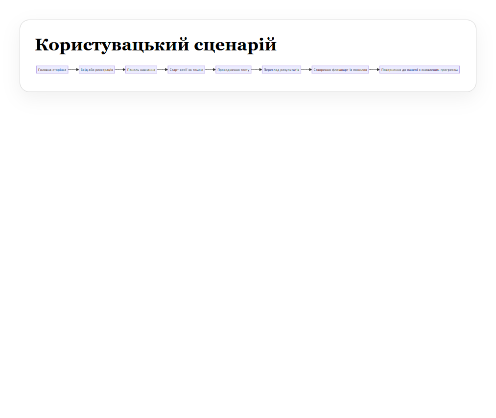

_Рисунок 2. Типовий навчальний цикл у системі: від входу до повторної практики за помилками._

Цей сценарій показує, що система побудована як цикл із зворотним зв’язком. Результати кожної попередньої дії формують матеріал для наступної. Саме це відрізняє платформу від звичайного одноразового онлайн-тесту.

\newpage

# 3. Архітектура програмної системи

## 3.1. Загальна архітектурна модель

Платформа побудована за класичною багатошаровою схемою. На верхньому рівні працює React SPA, який відповідає за інтерфейс, навігацію, локальний стан і виклики API. На середньому рівні розташовано Express-бекенд, що приймає HTTP-запити, виконує автентифікацію, валідацію, бізнес-логіку та роботу з даними. На нижньому рівні — локальна БД SQLite через sql.js, а як зовнішня інтеграція використовується OpenRouter / LLM-провайдер для генерації питань і флешкарт.

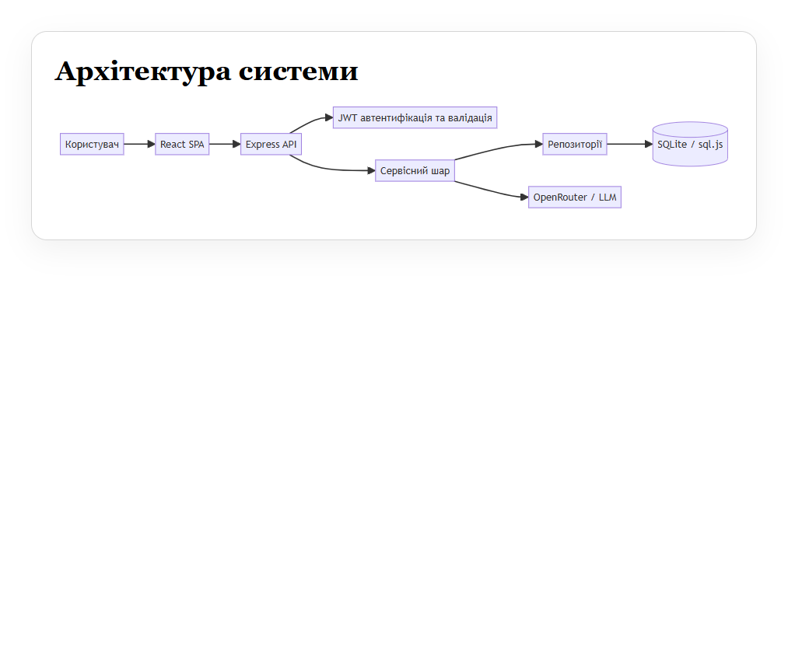

_Рисунок 3. Загальна архітектура застосунку: користувач взаємодіє з React-фронтендом, який звертається до Express API, сервісного шару, БД та LLM-провайдера._

Такий поділ є виправданим. Фронтенд не містить SQL-логіки та не намагається самостійно обчислювати складні освітні правила. Бекенд, у свою чергу, не займається відображенням. Це спрощує підтримку й дозволяє розширювати одну частину системи без переписування іншої.

## 3.2. Архітектура фронтенду

Фронтенд реалізовано на React 19 із використанням Vite як інструменту розробки та складання. Навігація побудована через React Router, а основні області стану згруповано у контексти: авторизація, навчальні дані, тестові дані, toast-повідомлення тощо. Це дає змогу сторінкам залишатися відносно декларативними, а логіку завантаження даних винести в окремі обгортки.

Ключові маршрути охоплюють:

1. Публічну головну сторінку.
2. Сторінки входу та реєстрації.
3. Панель навчання.
4. Екран старту нової теми.
5. Екрани створення тесту й керування власними тестами.
6. Сторінки флешкарт, досягнень і профілю.
7. Сторінки результатів та детальної аналітики.

Це означає, що фронтенд не обмежується однією функцією. Він описує повноцінну навчальну екосистему, де один модуль природно переходить в інший. Саме такий дизайн важливий для EdTech, оскільки освітній продукт рідко буває корисним у межах лише одного сценарію.

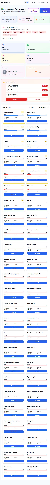

_Рисунок 4. Основна навчальна панель: швидкі дії, рекомендації, статистика прогресу, streak і перелік концептів формують єдину точку керування навчанням._

На рисунку видно, що навчальна панель виконує не декоративну, а операційну функцію. Звідси користувач може одразу перейти до нової сесії, флешкарт, практики слабких тем або детального перегляду концептів.

## 3.3. Архітектура бекенду

Бекенд побудований на Express 5 і згрупований за предметними областями. Серед ключових груп маршрутів виділяються `auth`, `tests`, `learning`, `flashcards` і `users`. Кожна група має власні `routes`-файли та контролери. Додатково в системі є окремі сервіси для генерації тестів, обчислення mastery, рекомендацій, флешкарт, досягнень і витягування концептів.

Такий поділ дуже важливий для підтримуваності. Контролер у цьому проєкті переважно координує запит: дістає параметри, викликає відповідний сервіс, повертає результат або помилку. Самі правила — наприклад, зміна mastery чи логіка recommendations — не розкидані випадково по контролерах, а сконцентровані в сервісних класах.

Це дає змогу говорити про наявність доменно орієнтованого бекенду, а не просто набору HTTP-обробників. Для бакалаврської кваліфікаційної роботи це позитивна ознака зрілості реалізації.

## 3.4. Послідовність автентифікації

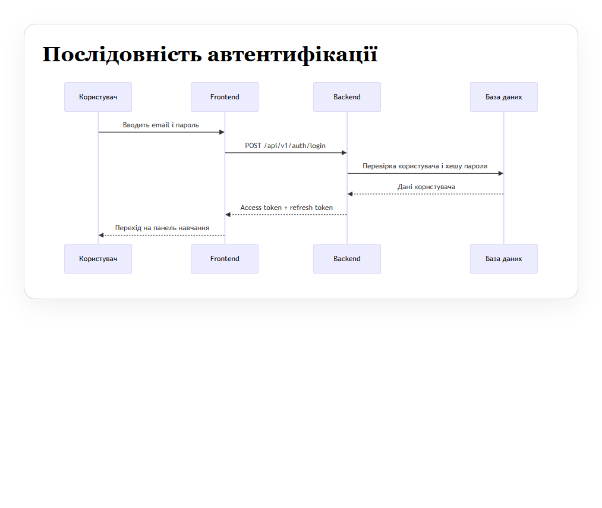

_Рисунок 5. Послідовність дій під час входу користувача: фронтенд передає облікові дані, бекенд перевіряє їх у БД та повертає токени доступу._

JWT-автентифікація реалізована як на рівні бекенду, так і в клієнті API на фронтенді. Фронтенд зберігає токен доступу та токен оновлення, автоматично прикріплює токен доступу до запитів і намагається оновити його через endpoint поновлення у разі `401 Unauthorized`. Це знижує кількість ситуацій, коли користувача несподівано викидає з приватних сторінок, і спрощує безперервну роботу з навчальними сценаріями.

## 3.5. Модель даних і persistence layer

Система використовує sql.js, тобто SQLite у WebAssembly-формі всередині Node-середовища, із періодичним експортом БД у файл. Під час старту бекенд читає файл БД, якщо він існує, запускає міграції та працює далі з пам’яттєвою інстанцією бази, яку регулярно зберігає.

Це нетипове, але доволі практичне рішення для проєкту такого масштабу. Воно знижує інфраструктурну складність, не вимагає окремого сервера БД і при цьому зберігає можливість мати реальні SQL-таблиці, міграції та репозиторії. Для локального або навчального середовища це цілком виправданий компроміс.

Основні сутності БД: `users`, `tests`, `test_attempts`, `attempt_answers`, `user_concepts`, `practice_sessions`, `concept_practice_history`, `user_achievements`, `flashcard_decks`, `flashcards`, `refresh_tokens`.

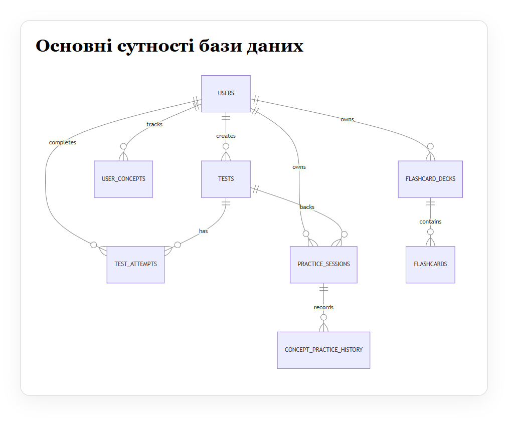

_Рисунок 6. Логічна модель даних: користувачі, тести, спроби, концепти, навчальні сесії та флешкарти утворюють зв’язану структуру навчальної історії._

## 3.6. API, валідація та помилки

API організовано за версією `/api/v1` і поділено за доменами. Це робить його передбачуваним як для фронтенду, так і для тестів. Усі важливі вхідні дані проходять через Zod-схеми, які перевіряють типи, обмеження, допустимі значення фільтрів, діапазони чисел та обов’язкові поля. Такий підхід одразу підвищує стабільність системи.

Окрему роль відіграє структура помилок. Замість хаотичних рядків у проєкті використовується окремий клас `ApiError`, який формує код, HTTP-статус та повідомлення. Це важливо тому, що клієнт API на фронтенді вміє мапити окремі коди бекенду на зрозумілі користувачу повідомлення. Таким чином, обробка помилок є наскрізною й узгодженою між шарами системи.

\newpage

# 4. Реалізація ключових функціональних модулів

## 4.1. Навчальна панель і керування прогресом

Навчальна панель є центром усієї системи. Саме тут зібрано агреговану картину навчання: статистика прогресу, слабкі теми, прострочені повторення, короткі рекомендації, список концептів, рівень користувача та серію активних днів. У вдалому EdTech-продукті така панель має не просто відображати числа, а скеровувати наступні дії. У цій системі це реалізовано через кнопки швидкого старту, рекомендаційну панель та список концептів із можливістю негайного переходу до практики.


_Рисунок 7. Навчальна панель поєднує аналітику та дії: користувач бачить прогрес і може одразу перейти до нової теми, флешкарт або короткої практики._

Окремою перевагою є наявність не лише узагальнених цифр, а й структури слабких концептів, прострочених повторень та рекомендацій. Це означає, що система не змушує користувача самому вирішувати, що робити далі. Вона підказує наступний крок і робить це на підставі накопичених даних.

## 4.2. Вибір теми та старт адаптивної сесії

Сторінка старту за темою показує одну з найважливіших переваг системи: вона не прив’язана до фіксованого курсу. Користувач може задати будь-яку тему, вибрати режим генерації — “AI freestyle”, вставку нотаток або завантаження файлу — і отримати персоналізовану практику.

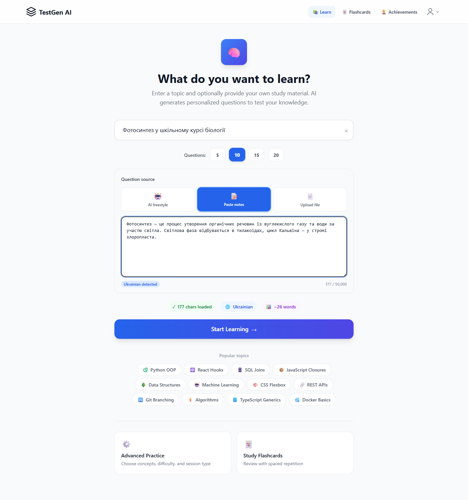

_Рисунок 8. Сторінка старту навчання в режимі вставлення нотаток: користувач задає тему, кількість питань і джерело матеріалу, після чого може одразу запустити персоналізовану практику._

Це рішення особливо цінне для навчання за власними конспектами. Користувачеві не потрібно вручну вигадувати питання. Він вставляє матеріал, а система використовує його як джерело для наступного тестування. Такий сценарій робить платформу корисною не лише для формальних курсів, а й для індивідуальної підготовки.

## 4.3. Створення власного тесту

Окремий модуль створення тесту орієнтований уже не стільки на самонавчання, скільки на контроль знань і можливість ділитися тестами з іншими. Тут користувач може задати тему або файл, назву тесту, кількість питань, складність, час та додаткові інструкції.

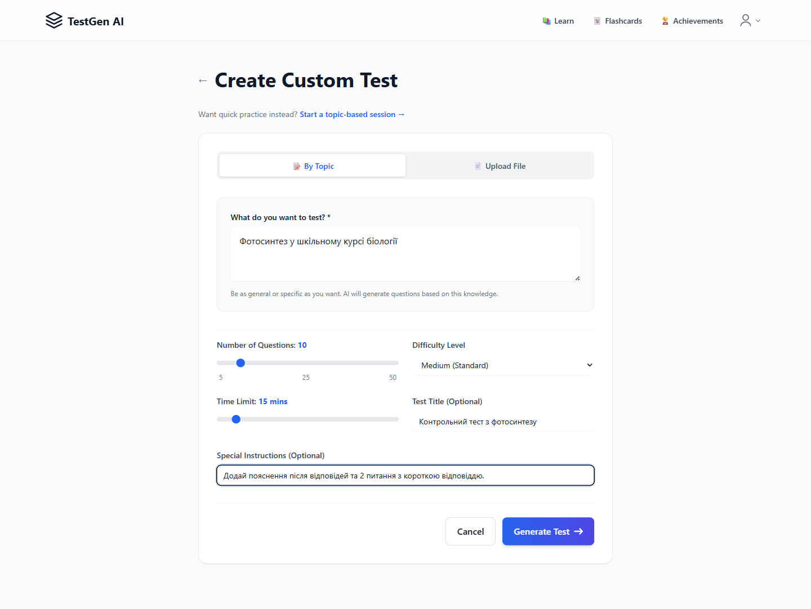

_Рисунок 9. Екран створення тесту містить уже заповнену тему, назву, складність, час і додаткові інструкції, що дає змогу сформувати керований сценарій генерації._

З інженерного погляду важливо, що ця форма не просто відсилає довільний текст у ШІ. Вона перетворює ввід користувача на контрольований набір параметрів, який бекенд може валідувати, зберегти та використати повторно. Це робить функцію генерації тесту відтворюваною та технічно керованою.

## 4.4. Бібліотека власних тестів

Модуль `My Tests` є авторською частиною системи. Тут зберігаються згенеровані тести, їхній статус, коди доступу, дати створення та завершення, а також переходи до аналітики.

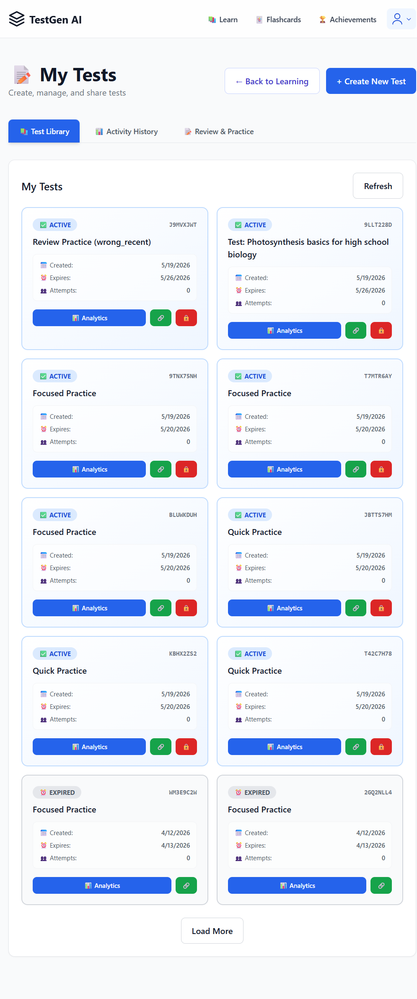

_Рисунок 10. Бібліотека тестів демонструє, що кожен тест у системі є повноцінним об’єктом із життєвим циклом, а не одноразовим результатом генерації._

На екрані добре видно активні й прострочені тести, коди, статистику спроб та кнопки для відкриття аналітики чи копіювання посилання. Це важливий функціональний рівень, бо багато освітніх інструментів добре генерують контент, але слабо підтримують його подальше адміністрування.

## 4.5. Історія спроб користувача

Система зберігає не лише власні тести, а й історію персональних проходжень. Це дає користувачу змогу бачити довготривалу динаміку, повертатися до попередніх результатів і оцінювати, чи повторне навчання покращило оцінки.

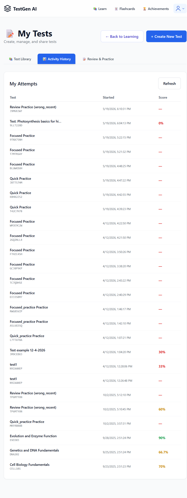

_Рисунок 11. Історія спроб відображає час старту та підсумковий бал для різних тестів і практик. Це важлива частина аналітики навчального процесу._

Така вкладка корисна не лише як архів. Вона формує відчуття історичності навчання: користувач бачить, що система пам’ятає попередні спроби, а не існує “лише в моменті”. Це підвищує цінність накопичених даних.

## 4.6. Тести для повторення на основі помилок

Однією з найсильніших функцій системи є можливість генерувати тести для повторення з неправильних відповідей. Це набагато корисніше, ніж просто показати загальний відсоток. Такий підхід перетворює помилку на ресурс для наступної практики.

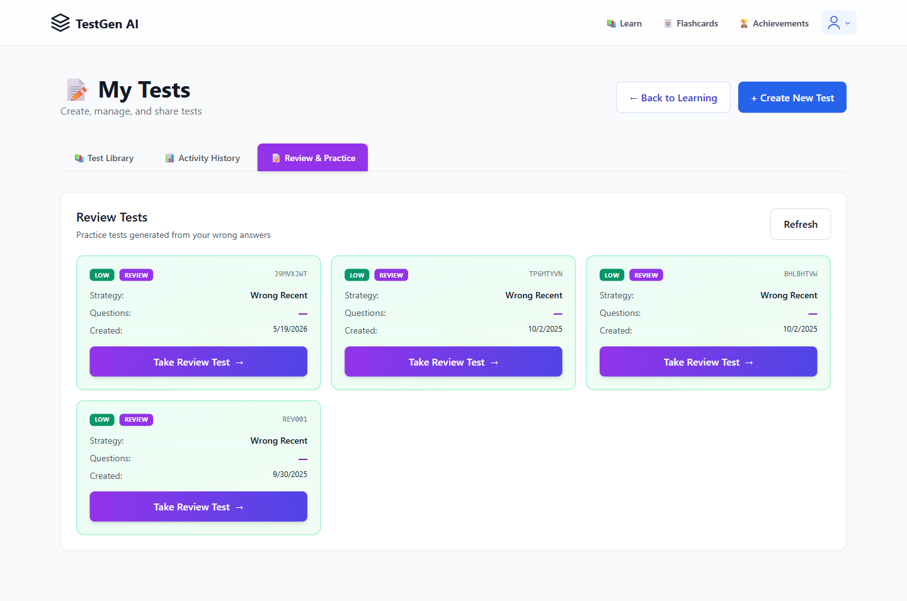

_Рисунок 12. Вкладка Review & Practice уже містить окремі картки тестів для повторення, сформованих на основі попередніх помилок користувача._

Сам факт існування окремої вкладки для повторної практики є ознакою того, що система орієнтується на повторення та закріплення, а не лише на разове тестування.

## 4.7. Сторінки флешкарт

Флешкарти в системі представлені як окремий модуль зі списком колод, окремими сторінками колод, режимом study та AI generation. Це не другорядне доповнення, а повноцінна підсистема довготривалого повторення.

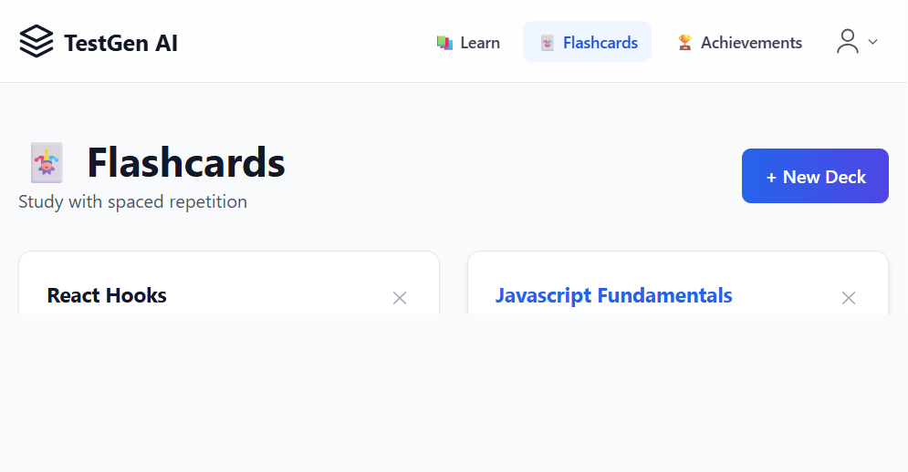

_Рисунок 13. Список колод флешкарт показує наявні тематичні набори і дає користувачу вхід у регулярне повторення матеріалу._

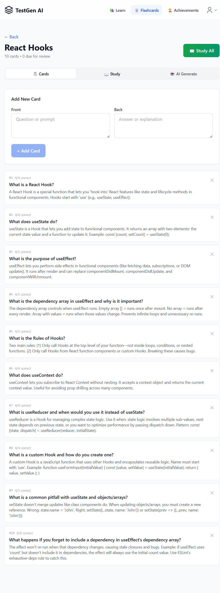

_Рисунок 14. Сторінка колоди містить список карток, кнопку навчання, форму ручного додавання та вкладку для ШІ-генерації._

Ця сторінка добре ілюструє перевагу архітектури: один і той самий модуль підтримує ручне створення карток, алгоритмічне повторення та генерацію від ШІ. Це підвищує гнучкість продукту.

## 4.8. Досягнення та гейміфікація

Система не обмежується статистикою. Вона ще й візуалізує прогрес через досягнення, рівні та прогрес-бари.

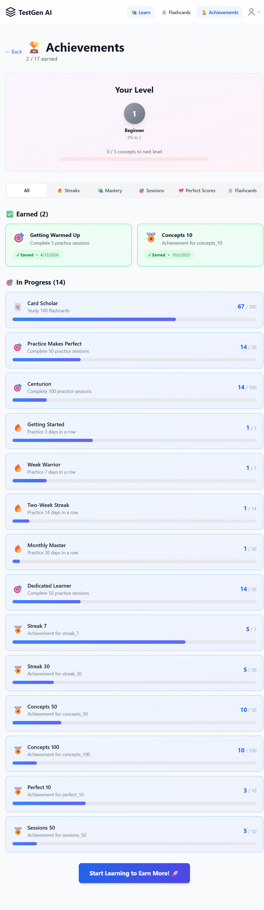

_Рисунок 15. Досягнення подано окремими категоріями: streak, mastery, sessions, perfect scores та flashcards. Це формує мотиваційний контур навколо навчання._

Гейміфікація в проєкті прив’язана до реальних навчальних дій, а не до випадкової активності. Саме тому вона не виглядає штучною: користувач одержує сигнали про свій прогрес, які відображають реальну історію практики.

## 4.9. Деталі концепту

Сторінка деталізації концепту переводить користувача з рівня узагальнення до рівня конкретної теми. Вона показує mastery, дату останньої практики, дату наступного повторення, коротку історію останніх спроб і можливість одразу перейти до цільової практики.

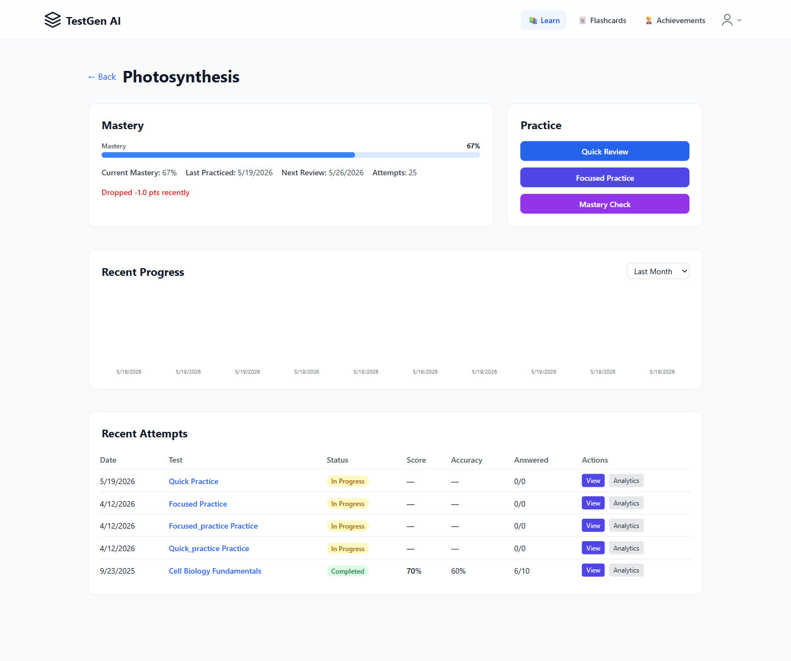

_Рисунок 16. Сторінка концепту показує рівень засвоєння, кнопки практики, блок недавнього прогресу та таблицю останніх спроб, тобто дає аналітику саме по цій темі._

Це суттєво підсилює навчальну корисність системи, адже користувач отримує не тільки відповідь “як я вчуся загалом?”, а і “який саме концепт у мене просідає і що з ним робити далі?”.

## 4.10. Сторінка результатів після проходження тесту

Один із найважливіших екранів у системі — це результати спроби. Тут видно загальний бал, кількість правильних і неправильних відповідей, а нижче — детальний перегляд кожного питання з hint-блоками.

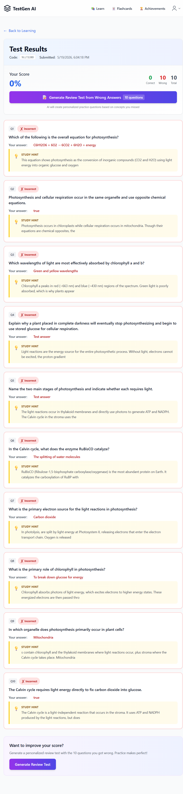

_Рисунок 17. Екран результатів не обмежується відсотком, а містить навчальні підказки для кожної помилки й пропонує створити тест для повторення._

Це сильне UX-рішення: користувач одразу бачить, що його помилки не губляться, а перетворюються на матеріал для подальшої роботи. Таким чином, етап “після тесту” стає не фіналом, а новим входом у процес навчання.

## 4.11. Лідерборд і аналітика власника тесту

Власник тесту має окремий режим перегляду аналітики. Тут зібрано список учасників, час старту, час відправлення та результат кожної спроби.

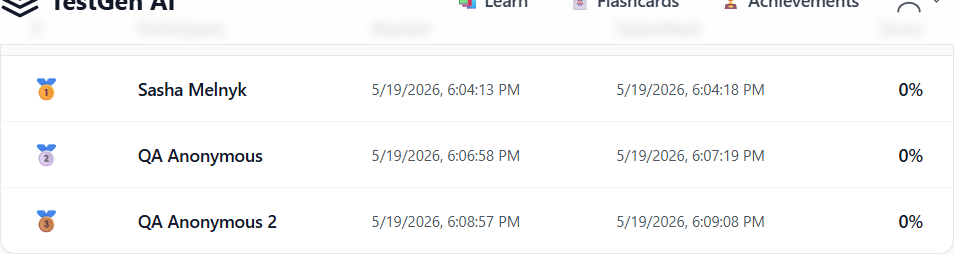

_Рисунок 18. Лідерборд дозволяє власнику тесту порівнювати результати учасників і відкривати конкретні спроби для детального перегляду._

Навіть якщо цей модуль у поточній версії не є надто складним візуально, його присутність принципово важлива. Вона показує, що система підтримує не лише сценарій “я сам себе тестую”, а й сценарій “я створив тест для інших і контролюю його проходження”.

## 4.12. Детальна аналітика спроби для власника

Окремий екран для власника тесту дає змогу переглядати не лише бал, а й правильні відповіді, порівняння з відповіддю користувача та додаткові пояснення. Саме тут проходить межа між звичайним режимом учасника та режимом власника.

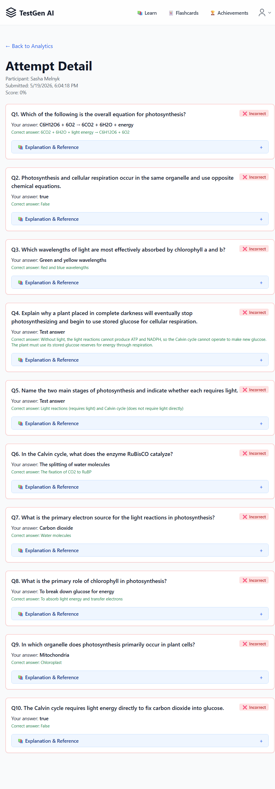

_Рисунок 19. Власник тесту бачить правильні відповіді та може аналізувати, де саме користувач помилився. Це окремий рівень контролю доступу у системі._

\newpage

# 5. Алгоритми, обчислення та логіка прийняття рішень

## 5.1. Обчислення mastery і підбір складності

Сервіс `MasteryCalculationService` є ядром адаптивної логіки. Він виконує кілька критично важливих обчислень:

1. Оновлює mastery залежно від складності та правильності відповіді.
2. Визначає наступну дату повторення.
3. Пропонує базовий рівень складності для концепту.
4. Формує розподіл easy / medium / hard для адаптивної сесії.
5. Аналізує недавні відповіді та може підвищити або знизити складність.

Евристика розподілу складності працює так:

| Mastery  | Easy | Medium | Hard |
| -------- | ---: | -----: | ---: |
| менше 30 |  80% |    20% |   0% |
| 30–59    |  40% |    50% |  10% |
| 60–79    |  20% |    50% |  30% |
| 80+      |  10% |    20% |  70% |

Це досить проста, але практична стратегія. Новачок не отримує одразу складні питання, а досвідчений користувач не застрягає на базовому рівні. У цьому й полягає головна інженерна перевага подібної моделі: вона легко пояснюється і добре узгоджується з логікою інтерфейсу.

## 5.2. Рекомендаційна система

`RecommendationService` працює за принципом пріоритетів. Спочатку відбираються прострочені повторення, потім слабкі концепти, далі концепти з негативним трендом, пов’язані теми та, нарешті, advanced topics. Це означає, що система не просто віддає випадкові “поради”, а впорядковує наступні дії за освітньою важливістю.

Пріоритети можна представити так:

1. Прострочене повторення — найвищий пріоритет.
2. Слабкі концепти — високий пріоритет.
3. Погіршення останніх результатів — середній пріоритет.
4. Пов’язані теми — середній пріоритет.
5. Advanced topics — нижчий пріоритет.

Така модель є виправданою з погляду навчальної логіки: спочатку потрібно закрити ризик забування і прогалини, а вже потім розширювати горизонт знань.

## 5.3. Генерація тестів через LLM-пайплайн

Сервіс генерації тестів формує промпт із теми або вихідного тексту, передає його у LLM, очікує структурований JSON і виконує постобробку. З точки зору ПЗ це один із найважливіших модулів, бо саме він перетворює “неструктуровані наміри користувача” на формальний набір питань.

Пайплайн містить кілька важливих кроків:

1. Формування промпту та параметрів генерації.
2. Вибір моделі.
3. Запит до OpenRouter у режимі JSON-schema або fallback.
4. Обрізання або доповнення масиву питань до потрібного розміру.
5. Додавання explanation / reference, якщо модель їх не надала.
6. Збереження тесту, параметрів і code в БД.

Особливо цінною є підтримка імітаційного режиму в тестовому середовищі. Це дозволяє виконувати API-тести без залежності від зовнішнього ШІ-сервісу, що різко підвищує стабільність розробки та процесів безперервної інтеграції.

## 5.4. Логіка адаптивної навчальної сесії

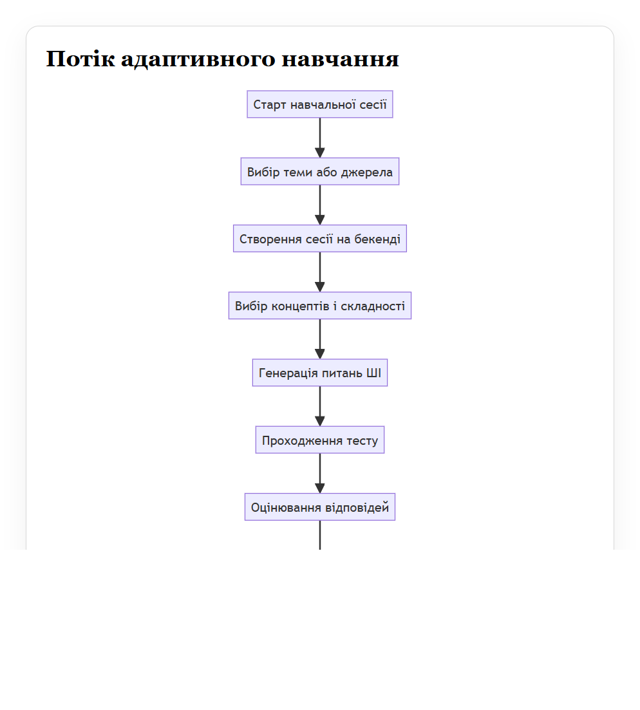

_Рисунок 20. Основний цикл адаптивної сесії: від створення практики до оновлення mastery, дати наступного повторення та рекомендацій._

У технічному сенсі адаптивна практика в системі не є окремою ізольованою підсистемою. Вона спирається на вже наявну інфраструктуру тестів, спроб, концептів та історії. Це хороше інженерне рішення, оскільки дозволяє багаторазово використовувати один і той самий foundation: тест як об’єкт, спроба як результат, історія як джерело аналітики.

## 5.5. Алгоритм роботи флешкарт

На відміну від звичайного перегляду карток “вперед-назад”, система використовує quality-based review. Після перевірки картки користувач оцінює, наскільки легко згадав відповідь. Ця оцінка впливає на інтервал до наступного повторення і на ease factor.

Псевдокод логіки:

```text
якщо quality < 3:
    interval = 0
    nextReview = now + 10 хвилин
інакше:
    якщо interval == 0: interval = 1
    якщо interval == 1: interval = 6
    інакше: interval = round(interval * easeFactor)
    easeFactor = max(1.3, оновлене значення за формулою SM-2)
    nextReview = now + interval днів
```

Цей модуль робить платформу корисною не тільки для первинного тестування, а й для регулярного навчального повторення.

\newpage

# 6. Практичний аналіз інтерфейсу та користувацьких сценаріїв

## 6.1. Підхід до збирання візуальних доказів

У межах цієї бакалаврської кваліфікаційної роботи скріншоти формувалися заново з працюючого застосунку за допомогою браузерної автоматизації. Під час перевірки були відкинуті кадри, на яких присутні порожні області або відсутній функціональний зміст. До фінального документа включено лише ті зображення, на яких видно корисний контент: списки тестів, статистику, результати, форми, таблиці, флешкарти, досягнення та деталізацію конкретних сценаріїв.

Це суттєво відрізняє поточну версію звіту від початкового автоматичного набору знімків, де частина кадрів була технічно коректною, але методично невдалою. У поточній версії ілюстрації виконують аналітичну функцію і справді допомагають читачу зрозуміти продукт.

## 6.2. Від головної сторінки до панелі навчання

Головна сторінка продукту відразу показує, що система підтримує два різних типи входу: індивідуальне навчання та приєднання до тесту за кодом. Це важливий сигнал з погляду зручності інтерфейсу, бо користувач відразу бачить межі продукту. Після авторизації основною точкою входу стає навчальна панель, а не, наприклад, список тестів. Це означає, що розробники правильно позиціонують систему не як вузький сервіс лише для тестів, а як повноцінну навчальну платформу.

## 6.3. Практика за темою і робота з власними матеріалами

Сторінка старту за темою є однією з найсильніших частин продукту. Користувач може почати навчання без попередньо створеного банку питань. Це різко знижує поріг входу і робить платформу універсальною. Наявність режимів “AI freestyle”, “Paste notes” та “Upload file” означає, що користувач може адаптувати продукт під свою ситуацію: швидкий старт, робота з конспектом або робота з документом.

## 6.4. Життєвий цикл тесту

Створений тест у системі не є ефемерною сутністю. Він має код доступу, метадані, ліміт часу, термін дії, список спроб та окремий режим аналітики власника. Це дуже важливо для продукту, який може використовуватись викладачем або власником контенту. Користувач може згенерувати тест, зберегти його, поширити, повернутись до нього пізніше, переглянути спроби та закрити доступ.

## 6.5. Післятестова робота з помилками

Найбільш дидактично сильним є екран результатів. У ньому поєднано загальний бал, розподіл правильних і неправильних відповідей, підказки для кожного питання й можливість створити тест для повторення. Це правильний дизайн для навчальної системи: результат не завершує сценарій, а дає точку входу в повторення.

## 6.6. Сценарій власника тесту

У більшості простих сервісів створення тестів автор не має зручної аналітики. У досліджуваному продукті власник тесту має окремі екрани для лідерборду та деталі кожної спроби. Це важлива функціональна вісь системи. Вона робить платформу потенційно корисною не тільки для самоосвіти, а й для навчальних груп, мінікурсів, курсів викладача чи внутрішнього тестування в команді.

\newpage

# 7. Тестування, безпека, надійність та якість

## 7.1. Виконані автоматизовані тести

Для підтвердження працездатності системи були виконані релевантні бекенд-тести. Запущено набори `learningEndpoints.test.js` та `newFeatures.test.js`. Підсумок перевірки: **2 test suites passed, 31 tests passed**. Це важливий результат, оскільки він підтверджує не тільки наявність тестів у репозиторії, а й їхню реальну виконуваність у поточному середовищі.

Перевірені сценарії охоплюють, зокрема:

1. Роботу навчальних endpoint-ів і вимогу автентифікації.
2. Коректність фільтрів та пагінації для списку концептів.
3. Віддачу слабких і прострочених концептів.
4. Приховування правильних відповідей у режимі учасника.
5. Відображення правильних відповідей у режимі власника.
6. Порядок сортування лідерборду.
7. Неможливість почати нову спробу після закриття тесту.

Таким чином, тестування покриває не лише базові 200-OK сценарії, а й критично важливі граничні стани доступу та бізнес-логіки.

## 7.2. Імітаційний режим для генерації

Одна з найкращих інженерних практик, реалізованих у проєкті, — це імітаційний режим генерації в тестовому середовищі. Під час виконання тестів система не звертається до зовнішнього LLM-провайдера, а підміняє результати детермінованим мок-генератором. Це різко підвищує стабільність тестів, знижує час виконання та усуває ризик випадкового падіння пайплайну через зовнішній API.

Для ШІ-інтегрованих систем це не просто зручність, а необхідність. Без імітаційного режиму будь-який тест набував би залежності від мережі, ключів, квот і непередбачуваної поведінки моделі.

## 7.3. Безпека та контроль доступу

Безпека в системі реалізована на декількох рівнях.

### 7.3.1. Автентифікація

Використовуються JWT-токен доступу і токен оновлення. Фронтенд уміє поновлювати токен доступу без повторного входу користувача, а бекенд надає для цього окремий endpoint.

### 7.3.2. Захист приватних екранів

Маршрути навчання, флешкарт, досягнень, профілю та власних тестів захищені через private route на фронтенді й auth middleware на бекенді.

### 7.3.3. Розмежування доступу власника та учасника

Учасник тесту не повинен бачити правильні відповіді доти, доки система не дозволить це за сценарієм. Власник тесту, навпаки, має бачити повну аналітику. Саме ця різниця перевірялась тестами й підтверджена окремими екранами participant detail та owner attempt detail.

### 7.3.4. Валідація запитів

Вхідні дані перевіряються через Zod. Це захищає від помилок формату, неправильних типів, неприпустимих значень і випадкових логічних збоїв ще до того, як запит потрапляє у бізнес-логіку.

## 7.4. Надійність збереження даних

sql.js із періодичним експортом у файл — нетипове, але для поточного масштабу практичне рішення. Воно простіше, ніж окремий сервер БД, і достатнє для локального або демонстраційного середовища. Водночас потрібно розуміти його межі: у більшому продакшн-сценарії система, найімовірніше, потребуватиме переходу на серверну реляційну БД.

## 7.5. Матриця ризиків

| Ризик                              | Ймовірність | Вплив              | Поточне пом’якшення                    | Подальше покращення                          |
| ---------------------------------- | ----------- | ------------------ | -------------------------------------- | -------------------------------------------- |
| Неточні питання від ШІ             | Середня     | Високий            | JSON schema, постобробка, explanations | модерація й оцінка якості контенту           |
| Слабка масштабованість persistence | Середня     | Середній / високий | sql.js + export                        | перехід на серверну БД                       |
| Недостатня прозорість рекомендацій | Середня     | Середній           | явний список рекомендацій у UI         | додати пояснення причин і confidence signals |
| Проблеми з доступом до owner data  | Низька      | Високий            | middleware, окремі маршрути, тести     | розширений аудит дій                         |
| Невірні дані від користувача       | Середня     | Середній           | Zod-валідація                          | ширша перевірка файлів і текстів             |
| Залежність від зовнішнього LLM API | Середня     | Високий            | імітаційний режим у тестах             | черга фонових задач і повторні спроби        |

## 7.6. Оцінка якості інтерфейсу

З позиції UI/UX продукт має одну сильну рису: більшість екранів безпосередньо прив’язана до реальних дій. Кнопки “Start Learning”, “Practice Now”, “Create Flashcards from Mistakes”, “Take Review Test”, “Study All” не ведуть у декоративні сторінки, а запускають конкретні сценарії. Це робить інтерфейс продуктивним. Навіть там, де текст у UI поки англомовний, логіка навігації залишається послідовною та зрозумілою.

\newpage

# 8. Напрями розвитку та вдосконалення

## 8.1. Переваги поточної реалізації

За результатами аналізу можна виділити такі сильні сторони системи:

1. Цілісність продукту: генерація тестів, повторення, аналітика й флешкарти працюють як єдиний навчальний цикл.
2. Хороша архітектурна декомпозиція: фронтенд, бекенд, сервісний шар і репозиторії чітко розділені.
3. Реальна адаптивна логіка, а не лише маркетингове використання слова “adaptive”.
4. Наявність автоматизованих тестів і імітаційного режиму для ШІ.
5. Підтримка двох сценаріїв використання: самонавчання та сценарій “власник — учасник”.
6. Наявність довготривалої пам’яті про навчання через concepts, sessions, achievements, flashcards.

## 8.2. Обмеження поточної версії

Попри сильні сторони, система має і низку обмежень.

По-перше, модель mastery є евристичною. Вона достатньо практична для MVP або навчального продукту малого масштабу, але не враховує глибокі психометричні властивості питань.

По-друге, якість генерації все ще залежить від зовнішньої моделі. Навіть із жорстким JSON-форматом немає повної гарантії якості змісту.

По-третє, persistence layer поки не призначений для інтенсивного багатокористувацького навантаження.

По-четверте, частина UI-текстів англомовна, тоді як сама кваліфікаційна робота й аналіз ведуться українською. Для реального релізу це означає потребу в internationalization або принаймні уніфікації мовного стилю.

## 8.3. Практичні напрями покращення

1. Додати механізм оцінки якості згенерованих питань користувачем.
2. Реалізувати модерацію або перевірку питання викладачем перед масовим поширенням.
3. Перенести зберігання даних на повноцінну серверну БД для production-режиму.
4. Впровадити job queue для асинхронної генерації.
5. Розширити analytics-модуль для викладача: середній бал, найскладніші питання, типові помилки.
6. Додати E2E-тести фронтенду для критичних маршрутів.
7. Уніфікувати локалізацію UI.
8. Додати експорт результатів та звітів.

## 8.4. Освітня й етична перспектива

Системи такого типу мають подвійний потенціал. З одного боку, вони суттєво знижують поріг входу в активне навчання та роблять самопідготовку більш структурованою. З іншого — вони створюють нові зони відповідальності: необхідно забезпечити точність контенту, прозорість рекомендацій, захист персональних даних і коректне поводження з результатами користувачів.

Саме тому подальший розвиток подібних платформ має поєднувати не тільки технічне вдосконалення, а й педагогічну відповідальність. ШІ може прискорити навчання, але лише за умови, що вся система навколо нього побудована дисципліновано та перевіряється не гірше, ніж звичайне вебПЗ.

\newpage

# ВИСНОВКИ

У межах цієї бакалаврської кваліфікаційної роботи було виконано повний технічний і функціональний аналіз реальної інтелектуальної вебплатформи адаптивного навчання AI-Learn / TestGen AI. Дослідження показало, що система є значно складнішою за типовий генератор тестів. Вона поєднує генерацію завдань засобами ШІ, збереження навчальної історії, концептно-орієнтований облік прогресу, повторення за інтервалами, флешкарти, тести для повторення, досягнення, аналітику власника тесту та односторінковий інтерфейс із багатьма навчальними сценаріями.

З точки зору архітектури проєкт демонструє зрілі інженерні рішення. Фронтенд побудовано на React із чіткою маршрутизацією та контекстами стану. Бекенд має виразну доменну структуру: маршрути, контролери, сервіси, репозиторії та окремі модулі валідації. Рівень збереження даних є легким, але логічно узгодженим із поточним масштабом задачі. Система помилок, валідація запитів і імітаційний режим генерації підсилюють стабільність і тестованість рішення.

З точки зору освітньої логіки проєкт є цінним прикладом перенесення сучасних дидактичних підходів у прикладне програмне забезпечення. У ньому реалізовано навчання до опанування, адаптивне навчання, повторення за інтервалами і мотиваційні механізми, які не існують ізольовано, а з’єднані в один навчальний цикл. Особливо важливо, що помилки користувача використовуються не тільки для оцінювання, а й для подальшого навчання — через флешкарти, тести для повторення та рекомендації.

Під час підготовки роботи було підтверджено, що система не є лише концептом. Вона працює локально, має наповнений інтерфейс, реальні навчальні сценарії та проходить релевантні автоматизовані тести. Новий набір скріншотів, використаний у документі, демонструє не порожні сторінки, а реальні функціональні екрани, придатні для технічного аналізу.

Отже, можна зробити висновок, що AI-Learn / TestGen AI є технічно послідовною, педагогічно осмисленою та перспективною основою для подальшого розвитку адаптивних навчальних вебсистем. Проєкт достатньо зрілий для академічного розгляду, але водночас зберігає простір для значущих удосконалень, що робить його вдалим об’єктом для бакалаврської кваліфікаційної роботи.

\newpage

# СПИСОК ВИКОРИСТАНИХ ДЖЕРЕЛ

1. Bloom B. S. Learning for Mastery. Evaluation Comment, 1968.
2. Ebbinghaus H. Memory: A Contribution to Experimental Psychology. 1885.
3. Wozniak P. Principles of spaced repetition and SuperMemo materials.
4. React Documentation. https://react.dev/
5. Express Documentation. https://expressjs.com/
6. SQLite Documentation. https://www.sqlite.org/docs.html
7. RFC 7519: JSON Web Token (JWT).
8. Zod Documentation. https://zod.dev/
9. Vite Documentation. https://vite.dev/
10. OpenRouter Documentation. https://openrouter.ai/docs
11. Fowler M. Patterns of Enterprise Application Architecture.
12. Nielsen J. Usability Engineering.
13. OWASP Foundation. Web Application Security resources.
14. Tailwind CSS Documentation. https://tailwindcss.com/docs
15. Jest Documentation. https://jestjs.io/docs/getting-started
16. Sweller J. Cognitive Load Theory.
17. Anderson J. R. Cognitive Psychology and Its Implications.
18. Merrill M. D. First Principles of Instruction.
19. SuperMemo knowledge base on SM-2 review scheduling.
20. Fielding R. Architectural Styles and the Design of Network-based Software Architectures.

\newpage

# ДОДАТОК А. Карта екранів, використаних у звіті

| Ілюстрація                         | Що показує            | Навіщо використана                                          |
| ---------------------------------- | --------------------- | ----------------------------------------------------------- |
| `ua-final-01-home.png`             | Головну сторінку      | Пояснення двох сценаріїв входу в систему                    |
| `ua-final-02-dashboard.png`        | Панель навчання       | Демонстрація центральної навчальної панелі                  |
| `ua-final-03-topic-start.png`      | Старт сесії за темою  | Пояснення потоку адаптивного навчання                       |
| `ua-final-04-create-test.png`      | Форму створення тесту | Демонстрація сценарію власника тесту                        |
| `ua-final-05-my-tests.png`         | Бібліотеку тестів     | Показ життєвого циклу тестів                                |
| `ua-final-06-activity-history.png` | Історію спроб         | Ілюстрація накопичуваної навчальної історії                 |
| `ua-final-07-review-tests.png`     | Тести для повторення  | Показ повторення за помилками                               |
| `ua-final-08-flashcards.png`       | Список колод          | Показ модуля повторення                                     |
| `ua-final-09-flashcard-deck.png`   | Деталі колоди         | Демонстрація карток, додавання та AI generation             |
| `ua-final-10-achievements.png`     | Досягнення            | Ілюстрація гейміфікації                                     |
| `ua-final-11-concept-detail.png`   | Сторінку концепту     | Показ аналітики на рівні теми                               |
| `ua-final-12-results.png`          | Результати тесту      | Пояснення роботи з помилками                                |
| `ua-final-13-analytics-table.png`  | Лідерборд             | Показ власницької аналітики                                 |
| `ua-final-14-owner-attempt.png`    | Деталі спроби         | Демонстрація розмежування доступу між власником і учасником |

# ДОДАТОК Б. Зведення API-маршрутів

| Група маршрутів      | Приклади endpoint                                                                          | Роль у системі                       |
| -------------------- | ------------------------------------------------------------------------------------------ | ------------------------------------ |
| `/api/v1/auth`       | `register`, `login`, `refresh`, `me`, `logout`                                             | Автентифікація та профіль            |
| `/api/v1/tests`      | `generate`, `code/:code`, `start`, `submit`, `mine`, `leaderboard`, `close`, `review`      | Тести, спроби, поширення й аналітика |
| `/api/v1/learning`   | `dashboard`, `concepts`, `weak-concepts`, `due-reviews`, `sessions/create`, `achievements` | Адаптивне навчання та прогрес        |
| `/api/v1/flashcards` | `decks`, `study`, `review`, `generate`, `from-attempt`                                     | Повторення та флешкарти              |
| `/api/v1/users`      | `/:id`                                                                                     | Публічний профіль користувача        |
| `/health`            | `GET /health`                                                                              | Перевірка доступності сервісу        |

# ДОДАТОК В. Псевдокод ключових алгоритмів

## В.1. Оновлення mastery

```text
вхід: currentMastery, difficulty, wasCorrect
обрати вагу зміни за difficulty і wasCorrect
newMastery = currentMastery + weight
if newMastery < 0 -> newMastery = 0
if newMastery > 100 -> newMastery = 100
повернути newMastery
```

## В.2. Планування повторення концепту

```text
вхід: mastery
if mastery < 30 -> 1 день
else if mastery < 50 -> 3 дні
else if mastery < 70 -> 7 днів
else if mastery < 80 -> 14 днів
else if mastery < 90 -> 30 днів
else -> 60 днів
```

## В.3. Оцінювання флешкарти за SM-2

```text
вхід: quality, interval, easeFactor
if quality < 3:
    interval = 0
    nextReview = now + 10 хвилин
else:
    if interval == 0: interval = 1
    else if interval == 1: interval = 6
    else: interval = round(interval * easeFactor)
    easeFactor = max(1.3, updatedEaseFactor)
    nextReview = now + interval днів
повернути interval, easeFactor, nextReview
```

# ДОДАТОК Г. Підсумок валідації під час підготовки кваліфікаційної роботи

Під час підготовки документа було виконано такі дії:

1. Проаналізовано структуру репозиторію, основні модулі фронтенду і бекенду.
2. Перевірено працюючий застосунок у браузері з використанням тестового облікового запису.
3. Заново створено набір інформативних скріншотів без порожніх екранів і випадкових полотен.
4. Побудовано окремий набір діаграм українською мовою.
5. Виконано цільові тести бекенду `learningEndpoints.test.js` та `newFeatures.test.js`, усі 31 тест пройшли успішно.

# ДОДАТОК Д. Експорт у DOCX

Файл підготовлено в Pandoc-сумісному форматі. Типова команда експорту:

```powershell
pandoc coursework.md -o coursework.docx
```

За потреби можна додати `reference-doc`, якщо заклад вимагає шаблон Word із фіксованим стилем. Поточний YAML уже задає 14pt, Times New Roman, міжрядковий інтервал 1.5, нумерацію розділів і зміст.

# ДОДАТОК Е. Деталізована декомпозиція компонентів системи

У цьому додатку подано більш глибокий опис того, як саме окремі частини проєкту взаємодіють між собою. Така деталізація корисна з академічної точки зору, оскільки дозволяє перейти від опису “що робить система” до аналізу “як саме це організовано на рівні коду”. Для бакалаврської кваліфікаційної роботи це важливо, бо якість ПЗ визначається не лише переліком функцій, а й структурою, яка підтримує ці функції у довгостроковій перспективі.

## Е.1. Клієнтський рівень

Фронтенд у досліджуваному проєкті можна умовно поділити на кілька категорій компонентів.

### Е.1.1. Сторінки

Сторінки — це верхній рівень користувацького інтерфейсу. Вони відповідають окремим маршрутам і зазвичай поєднують візуальні блоки, виклики контекстів та локальну взаємодію з користувачем. До цієї групи належать головна сторінка, сторінки входу та реєстрації, навчальна панель, старт сесії за темою, створення тесту, список тестів, флешкарти, досягнення, сторінки результатів та аналітики.

Архітектурна цінність полягає в тому, що сторінки не намагаються самостійно реалізувати повний цикл даних. Вони делегують запити контекстам або API-утилітам, а самі зосереджуються на оркестрації візуального сценарію. Це знижує зв’язність і полегшує подальше тестування або модифікацію UI.

### Е.1.2. Контексти стану

Контексти виконують роль прикладного шару на фронтенді. Наприклад, `AuthContext` відповідає за життєвий цикл користувача, зберігання токенів, реакцію на зміну сесії та надання методів для входу, виходу й оновлення профілю. `LearningContext` або пов’язані з ним модулі відповідають за дані навчальної панелі, концепти, рекомендації та сесії. `TestDataContext` оперує генерацією тестів, списком власних тестів, історією спроб, детальними даними аналітики та пов’язаними запитами.

Така структура означає, що бізнес-логіка клієнтського рівня не розмазана по десятках сторінок. Якщо сторінка потребує даних про власні тести, вона звертається до контексту, а не дублює логіку `fetch`-запиту, обробку помилок і перетворення відповіді щоразу наново. Це ознака гарної клієнтської архітектури.

### Е.1.3. Повторно використовувані компоненти

У проєкті присутні окремі компоненти на кшталт верхньої панелі, кнопок, лідерборду, модального вікна генерації тесту для повторення та інших блоків інтерфейсу. Їхня роль не лише у скороченні дублювання коду. Вони допомагають підтримувати сталу візуальну мову системи: однакові кнопки мають однакові сигнали дії, однакові картки мають однакові відступи, однакові списки відображають схожу структуру даних.

## Е.2. Серверний рівень

Бекенд побудовано таким чином, щоб розділити HTTP-взаємодію, предметну логіку та доступ до даних.

### Е.2.1. Routes

Файли маршрутів визначають URL-шляхи, методи HTTP, middleware та зв’язок із контролерами. Саме тут видно, як API групується за доменами: автентифікація, навчання, тести, флешкарти, користувачі. Така організація покращує навігацію по кодовій базі й робить API прозорішим для нових учасників команди.

### Е.2.2. Controllers

Контролери відповідають за зв’язок між HTTP-шаром і доменною логікою. Вони читають body, params, query, user context із middleware автентифікації, викликають відповідний сервіс і формують HTTP-відповідь. У хорошій реалізації контролер має бути тонким. У досліджуваному проєкті ця вимога переважно дотримана: основні правила навчання, рекомендацій або генерації сконцентровані в сервісах, а не в контролерах.

### Е.2.3. Services

Сервіси є найціннішим рівнем з погляду предметної логіки. Саме тут описано алгоритми, які перетворюють сирі дані на поведінку системи. `testGenerationService` керує ШІ-генерацією, `masteryCalculationService` обчислює показники адаптивного прогресу, `recommendationService` визначає пріоритети наступних дій, `achievementService` аналізує умови досягнень, `adaptiveQuestionService` і пов’язані модулі відповідають за навчальні сесії.

Виділення сервісів у окремі файли корисне не тільки для чистоти коду. Воно дає змогу тестувати логіку незалежно від Express, а також полегшує перенесення окремих правил у майбутньому, якщо система розростатиметься до більш складної модульної архітектури.

### Е.2.4. Repositories

Репозиторії відповідають за роботу з SQL-таблицями та приховують від сервісів деталі конкретних запитів. Це створює явну межу: сервіс мислить поняттями “отримати слабкі концепти”, “створити сесію”, “знайти спроби тесту”, а не конструкціями SQL. Репозиторний шар також робить код менш крихким у разі зміни схеми БД.

## Е.3. Запит як наскрізний процес

Щоб зрозуміти архітектуру не лише як статичний набір файлів, корисно простежити типовий життєвий цикл запиту.

Наприклад, коли користувач відкриває навчальну панель, клієнтська сторінка викликає метод контексту, контекст звертається до клієнта API, який додає JWT-токен доступу і відсилає HTTP-запит. Далі серверний маршрут направляє його до контролера, `middleware` перевіряє автентифікацію, Zod-схема валідує параметри, контролер викликає сервіс логіки навчальної панелі, сервіс звертається до кількох репозиторіїв, агрегує результати, повертає структуру даних, а фронтенд відображає її у вигляді карток, рекомендацій і списків концептів.

Такий наскрізний ланцюг демонструє, що система має передбачувану організацію. Вона не покладається на приховані глобальні стани чи магічні побічні ефекти. Для реальної інженерної команди це критично важливо, бо саме передбачуваність архітектури робить продукт підтримуваним у середньостроковій і довгостроковій перспективі.

## Е.4. Чому така декомпозиція є вдалою для EdTech-системи

Освітні системи часто швидко ускладнюються. Спочатку з’являється тестування, потім історія, далі повторення, потім рекомендації, потім аналітика, далі гейміфікація та інтеграція з ШІ. Якщо архітектура з самого початку не має чітких меж, вона швидко перетворюється на набір взаємозалежних хаотичних модулів. У досліджуваному проєкті цього вдалося уникнути завдяки поєднанню контекстів на фронтенді та service/repository pattern на бекенді.

З академічного погляду це важливий висновок: навіть навчальний або дипломний проєкт, якщо він претендує на складну поведінку, має проектуватися як багаторівнева система, а не як один “великий файл із логікою”. Саме ця дисципліна дозволяє розширювати функціональність без повного переписування ядра.

# ДОДАТОК Ж. Сценарії ручного тестування функціональності

Нижче подано приклади ручних тестових сценаріїв, які відповідають основним бізнес-можливостям системи. Такий додаток корисний для бакалаврської кваліфікаційної роботи, оскільки показує, що якість продукту можна оцінювати не лише автоматизованими тестами, а й формалізованими користувацькими перевірками.

## Ж.1. Вхід у систему

**Передумови:** існує активний користувач із валідними обліковими даними.  
**Кроки:**

1. Відкрити сторінку входу.
2. Ввести email і пароль.
3. Натиснути кнопку входу.

**Очікуваний результат:** користувач перенаправляється на навчальну панель, access token і refresh token коректно активні, приватні сторінки доступні.  
**Фактичне спостереження:** сценарій працює; після входу доступна навчальна панель і приватні модулі.

## Ж.2. Старт навчальної сесії за темою

**Передумови:** користувач авторизований.  
**Кроки:**

1. Відкрити сторінку старту навчання.
2. Вказати тему.
3. За потреби вставити нотатки або вибрати файл.
4. Натиснути запуск сесії.

**Очікуваний результат:** система створює практичну сесію й переводить користувача до виконання тестових завдань.  
**Фактичне спостереження:** сценарій реалізований; у документі наведено екран із заповненою формою та навчальними параметрами.

## Ж.3. Створення нового тесту

**Передумови:** користувач авторизований і має доступ до модуля створення тесту.  
**Кроки:**

1. Відкрити сторінку `Create Test`.
2. Заповнити назву, тему, складність, кількість питань, ліміт часу та інші параметри.
3. Запустити генерацію.

**Очікуваний результат:** новий тест з’являється в бібліотеці `My Tests`, отримує code і може бути поширений іншим користувачам.  
**Фактичне спостереження:** сценарій підтверджується екранами створення тесту та списку власних тестів.

## Ж.4. Перегляд історії власних тестів

**Передумови:** у користувача вже є хоча б один створений тест.  
**Кроки:**

1. Перейти до сторінки `My Tests`.
2. Перевірити статус, код і метадані тестів.
3. Натиснути перехід до аналітики для конкретного тесту.

**Очікуваний результат:** система показує таблицю або картки з тестами та надає доступ до подальших owner-сценаріїв.  
**Фактичне спостереження:** сценарій підтверджено; сторінка містить потрібні елементи керування.

## Ж.5. Перегляд історії спроб користувача

**Передумови:** користувач раніше проходив хоча б одну практику чи тест.  
**Кроки:**

1. Перейти до `Activity History`.
2. Перевірити наявність записів із датою та підсумковим балом.
3. Відкрити деталізацію окремої спроби.

**Очікуваний результат:** користувач бачить історичні записи та може повернутися до попередніх результатів.  
**Фактичне спостереження:** сторінка містить валідну історію кількох спроб.

## Ж.6. Генерація тесту для повторення

**Передумови:** у користувача є щонайменше одна спроба з помилками.  
**Кроки:**

1. Відкрити сторінку результатів спроби.
2. Натиснути створення тесту для повторення.
3. Перейти до вкладки практики для повторення.

**Очікуваний результат:** новий рев’ю-тест з’являється у відповідному розділі й відображає логіку повторення за помилками.  
**Фактичне спостереження:** вкладка тестів для повторення присутня й заповнена.

## Ж.7. Створення флешкарт із помилок

**Передумови:** користувач має доступ до результатів спроби з неправильними відповідями.  
**Кроки:**

1. Відкрити деталі результату.
2. Запустити створення флешкарт із помилок.
3. Перейти до сторінки флешкарт.

**Очікуваний результат:** у списку колод або в існуючій колоді з’являються нові картки, що відбивають проблемні теми.  
**Фактичне спостереження:** модуль флешкарт присутній, сторінка колоди містить картки та режими навчання.

## Ж.8. Власницька аналітика тесту

**Передумови:** існує створений тест із кількома спробами різних учасників.  
**Кроки:**

1. Відкрити аналітику власника для тесту.
2. Перевірити відображення лідерборду.
3. Обрати конкретну спробу для детального перегляду.

**Очікуваний результат:** система показує список учасників, часові відмітки та результати, а також дає доступ до owner detail view.  
**Фактичне спостереження:** таблиця лідерборду та сторінка деталі спроби успішно перевірені в браузері.

## Ж.9. Розмежування прав owner і participant

**Передумови:** існує тест із проходженням, доступний як учаснику, так і власнику.  
**Кроки:**

1. Відкрити результат як учасник.
2. Перевірити, що правильні відповіді не розкриваються так, як у власника.
3. Відкрити ту саму спробу як власник.
4. Перевірити наявність correct answer і пояснень.

**Очікуваний результат:** режим власника містить більше даних, ніж режим учасника, що відповідає політиці доступу.  
**Фактичне спостереження:** сценарій підтверджено як автоматизованими тестами, так і скріншотом owner attempt.

## Ж.10. Закриття тесту для нових спроб

**Передумови:** власник тесту має тест, доступний для проходження.  
**Кроки:**

1. Відкрити сторінку аналітики власника.
2. Натиснути `Close Test`.
3. Спробувати почати нову спробу через публічний сценарій.

**Очікуваний результат:** нові спроби заборонені, але історія наявних проходжень зберігається.  
**Фактичне спостереження:** такий сценарій покрито автоматизованими тестами.

## Ж.11. Методична цінність ручних сценаріїв

Ручні сценарії важливі тому, що вони показують продукт очима кінцевого користувача. Автоматизований тест може підтвердити, що endpoint повернув `200 OK`, але не завжди підтверджує, що вся зв’язка “інтерфейс – стан – API – відображення – доступ” є логічно цілісною. Саме тому для бакалаврської кваліфікаційної роботи доречно поєднувати обидва рівні перевірки: машинний і користувацький.

Крім того, формалізація ручних сценаріїв дисциплінує розвиток продукту. Якщо в майбутньому команда додаватиме новий модуль, для нього можна буде одразу сформулювати передумови, кроки, очікуваний результат і критерії приймання. Таким чином, ручні сценарії стають не лише інструментом демонстрації, а й елементом процесу розробки.

# ДОДАТОК З. Методичний коментар щодо освітньої цінності системи

З технічного погляду будь-який вебпроєкт можна описати мовою маршрутів, компонентів, таблиць і сервісів. Але для навчальної системи цього недостатньо. Потрібно також пояснити, чому конкретні функції мають педагогічний сенс. Саме цьому присвячено даний додаток.

По-перше, система добре реалізує принцип активного відтворення знань. Користувач не просто читає матеріал, а змушений відповідати на питання, відновлювати в пам’яті поняття, співставляти їх із контекстом і отримувати зворотний зв’язок. Це фундаментальна умова ефективного навчання, яку підтримують сучасні когнітивні дослідження.

По-друге, проєкт реалізує навчання через помилку. У традиційному освітньому досвіді помилка часто сприймається як фінальний негативний результат. У цій системі вона перетворюється на ресурс: з помилки можна створити тест для повторення або флешкарту, повернутися до концепту, який просідає, і побачити цю зміну на навчальній панелі. Таким чином, помилка не ізолює користувача, а вбудовується в цикл покращення.

По-третє, система підтримує метакогніцію. Навчальна панель, сторінка концепту, історія спроб і сторінка досягнень не лише показують “скільки балів набрано”, а дозволяють побачити структуру власного прогресу. Користувач може відповісти собі на питання: що саме я знаю слабше, коли я востаннє практикував цей концепт, чи є в мене прострочені теми, чи покращується мій результат. Такі механізми дуже важливі для усвідомленого навчання.

По-четверте, модуль флешкарт підтримує довготривалу пам’ять. У багатьох навчальних застосунках тестування і повторення існують окремо. Тут вони пов’язані. Це важливо тому, що одноразове правильне виконання не гарантує, що знання збережеться через тиждень або місяць. Система повторення за інтервалами дозволяє розтягнути навчальний ефект у часі.

По-п’яте, генерація тестів із власних матеріалів різко підвищує прикладну цінність системи. Користувачеві не потрібно чекати, доки викладач або адміністратор підготує питання. Він може взяти власний конспект, уривок зі статті чи тему з лекції й миттєво отримати активну практику. Це робить платформу особливо корисною в умовах самоосвіти, підготовки до іспитів або швидкого повторення перед заняттям.

По-шосте, власницька аналітика відкриває шлях до колективних освітніх сценаріїв. Якщо платформою користується не лише сам студент, а й викладач або автор курсу, аналітика спроб дозволяє побачити розподіл результатів, оцінити складність тесту й аналізувати типові помилки. Навіть у поточній версії цей модуль уже закладає основу для більш серйозного навчального менеджменту.

Разом із тим важливо усвідомлювати і методичні межі такої системи. ШІ може згенерувати формально коректне, але педагогічно неідеальне питання. Евристична модель mastery може спрощувати реальний процес засвоєння. Гейміфікація здатна підтримувати мотивацію, але не повинна підміняти собою навчальну мету. Саме тому найкраще розглядати платформу як інтелектуальний інструмент підтримки навчання, а не як повну заміну викладача або академічного курсу.

З огляду на це, освітня цінність системи полягає не в тому, що вона “все робить автоматично”, а в тому, що вона правильно організовує цикл навчальної взаємодії. Вона допомагає перейти від пасивного читання до активного відтворення, від разового тесту до повторення, від загального відсотка до аналізу конкретних концептів, від випадкових помилок до персоналізованого плану покращення. Саме такий перехід і є найважливішим результатом цифрової трансформації навчання.
